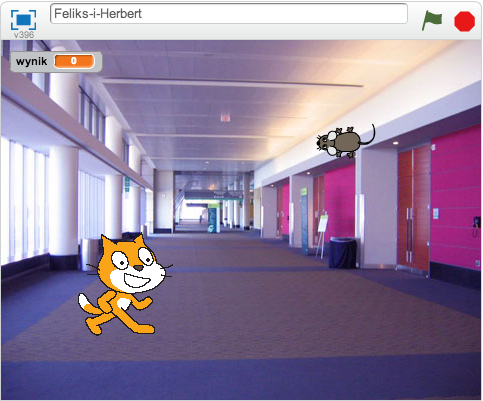

---
title: Feliks i Herbert
level: Poziom 1
language: pl-PL
stylesheet: scratch
embeds: "*.png"
materials: "Feliks-i-Herbert.sb2"
note: "Informacje dla prowadzacych zajecia.md"
...

# Wstęp {.intro}
Zrobimy grę w berka, w której kot Feliks goni mysz o imieniu Herbert. Będziesz sterować Herbertem przy pomocy myszki i masz za zadanie nie dać się złapać Feliksowi. Im dłużej będziesz przed nim uciekać, tym więcej punktów zdobędziesz. Nie daj się złapać, bo stracisz punkty!



# Krok 1: Feliks podąża za kursorem myszy {.activity}

## Zadania do wykonania {.check}

+ **Stwórz nowy projekt.**

+ Kliknij na **scenę** na lewo od duszka, następnie kliknij zakładkę `Tła` {.blocklightgrey}, a później kliknij na obrazek `Wybierz z biblioteki` {.blocklightgrey} i zaimportuj tło „hall” z katalogu „Indoors”. Usuń puste tło z listy.

+ Kliknij na duszka, następnie kliknij na ikonkę „i” w jego lewym górnym rogu. Zmień nazwę duszka na **Feliks**.
+ Upewnij się, że Feliks obraca się tylko w lewo i prawo, wciskając ten przycisk:
+ **Stwórz poniższy skrypt**:

    ```blocks
        kiedy kliknięto zieloną flagę
        zawsze
            idź do [wskaźnik myszy v]
            przesuń o (10) kroków
            następny kostium
            zagraj bębenkiem (3 v) przez (0.3) taktów
        koniec
    ```

## Przetestuj swój projekt {.flag}

**Kliknij zieloną flagę.**

Czy Feliks podąża za kursorem myszy? Czy wygląda jakby chodził? Czy porusza się z odpowiednią prędkością?

## Zapisz swój projekt. {.save}


# **Krok 2:** Feliks goni Herberta {.activity}

*Teraz sprawimy, aby Feliks zaczął gonić Herberta zamiast podążać za kursorem myszy.*

## Zadania do wykonania {.check}

+ Stwórz następnego duszka. Kliknij `wybierz nowego duszka z biblioteki` {.blockgrey} i wybierz **Zwierzęta/Mouse1**.
+ Zmień nazwę duszka na **Herbert**.
+ Przełącz na zakładkę __Kostiumy__, a następnie kliknij na kostium na środku edytora. Pojawi się prostokąt wokół kostiumu. Przeciągnij róg prostokąta i zmniejsz Herberta tak, aby był mniejszy od Feliksa.
+ Upewnij się, że Herbert obraca się tylko w lewo i prawo.
+ **Dodaj poniższy skrypt do Herberta:**

    ```blocks
        kiedy kliknięto zieloną flagę
        zawsze
            idź do [wskaźnik myszy v]
            ustaw w stronę [Feliks v]
        koniec
    ```

## Przetestuj swój projekt {.flag}

**Wciśnij zieloną flagę.**

Czy Herbert podąża za kursorem myszy? Czy Feliks goni Herberta?

## Zapisz swój projekt. {.save}


# **Krok 3:** Feliks ogłasza, że złapał Herberta {.activity}

**Chcemy, aby Feliks nam powiedział, że złapał Herberta.**

## Zadania do wykonania: {.check}

+ **Zmień skrypt Feliksa na poniższy:**

    ```blocks
      kiedy kliknięto zieloną flagę
      zawsze
        idź do [wskaźnik myszy v]
        przesuń o (10) kroków
        następny kostium
        zagraj bębenkiem (3 v) przez (0.3) taktów
        jeżeli <dotyka [Herbert v]?>
          powiedz [Mam cię!] przez (1) s
        koniec
      koniec
    ```

## Przetestuj swój projekt {.flag}

**Wciśnij zieloną flagę.**

Czy Feliks mówi, że złapał Herberta?

## Zapisz swój projekt. {.save}

# **Krok 4:** Herbert zamienia się w ducha po złapaniu

**Zamiast wiadomości od Feliksa, że złapał mysz, chcemy, aby Herbert zamienił się w ducha.**

## Zadania do wykonania {.check}

+ Zamień skrypt Feliksa na poniższy, aby nadać wiadomość o złapaniu Herberta.

    ```blocks
        kiedy kliknięto zieloną flagę
        zawsze
            idź do [wskaźnik myszy v]
            przesuń o (10) kroków
            następny kostium
            zagraj bębenkiem [3 v] przez (0.3) taktów
            jeżeli <dotyka [Herbert v]?>
                nadaj [złapany v]
                zagraj bębenkiem [17 v] przez (0.2) taktów
                czekaj (1) s
            koniec
        koniec
    ```

+ Dodaj Herbertowi nowy kostium: zaznacz Herberta, przejdź do zakładki Kostiumy i kliknij `wybierz kostium z biblioteki` {.blocklightgray}. Wybierz kostium  **Fikcja/ghost2-a**.

+ Zmniejsz nowy kostium klikając na niego w edytorze i przeciągając róg prostokąta, który się pojawi.

+ Zmień nazwy kostiumów Herberta: mysz nazwij „żywy”, a ducha - „nieżywy”.

+ **Dodaj nowy skrypt do Herberta, który zamienia go w ducha**:

    ```blocks
        kiedy otrzymam [złapany v]
        zmień kostium na [nieżywy v]
        czekaj (1) s
        zmień kostium na [żywy v]
    ```

## Przetestuj swój projekt {.flag}

**Wciśnij zieloną flagę.**

Czy Herbert zamienia się w ducha, gdy zostanie złapany?
Czy Feliks wydaje odpowiednie odgłosy w odpowiednich momentach?
Czy po złapaniu Feliks nie rusza się odpowiednio długo, aby Herbert mógł od niego uciec?

## Zapisz swój projekt. {.save}

# **Krok 5:** Liczymy punkty {.activity}

**Dodajmy licznik punktów, aby było widać, jak dobrze nam idzie ratowanie Herberta.
Zaczniemy od zera i co sekundę będziemy dodawać jeden punkt. Gdy Feliks złapie Herberta, odejmiemy sto punktów.**

## Zadania do wykonania {.check}

+ Stwórz zmienną o nazwie „Wynik” dla wszystkich duszków. Aby to zrobić, kliknij na `Dane` {.blockorange}, stwórz zmienną i nazwij ją `wynik` {.blockorange}. Upewnij się, że opcja "Dla wszystkich duszków" jest zaznaczona.

+ **Kliknij na Scenę i dodaj oba poniższe skrypty:**

    ```blocks
        kiedy kliknięto zieloną flagę
        ustaw [wynik v] na [0]
        zawsze
            zmień [wynik v] o (1)
            czekaj (1) s
        koniec

        kiedy otrzymam [złapany v]
        zmień [wynik v] o (-100)
    ```

## Przetestuj swój projekt {.flag}

**Wciśnij zieloną flagę.**

Czy wynik rośnie co sekundę o jeden punkt?
Czy ilość punktów spada o 100, kiedy Herbert zostanie złapany?
Co się dzieje, kiedy Herbert zostanie złapany zanim wynik wzrośnie do 100? Czy wynik zeruje się przy rozpoczęciu nowej gry?

## Zapisz swój projekt {.save}

**Brawo! To by było na tyle, teraz możesz cieszyć się swoją grą!**

Nie zapomnij, że możesz podzielić się swoją grą ze swoimi przyjaciółmi i rodziną. Żeby to zrobić, kliknij menu **Udostępnij**.
